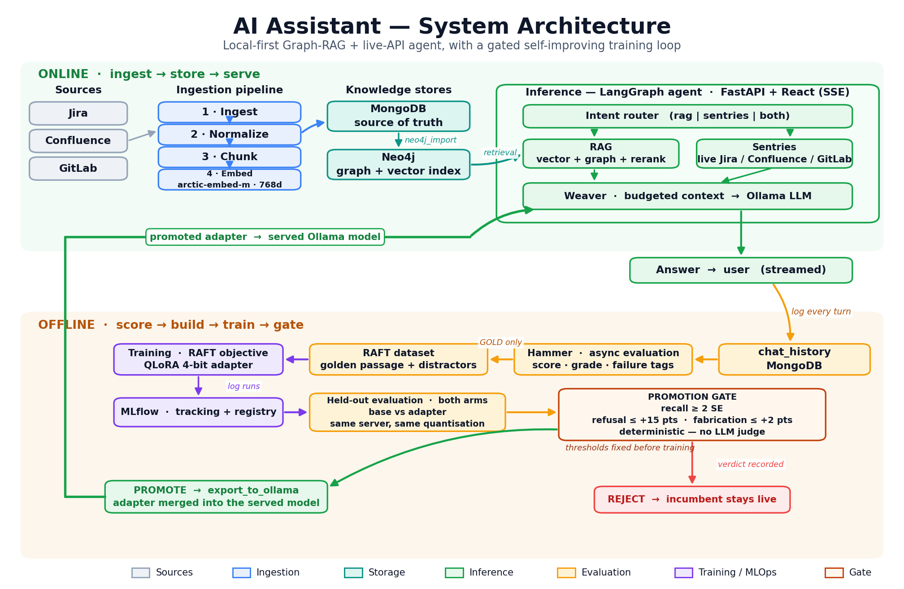
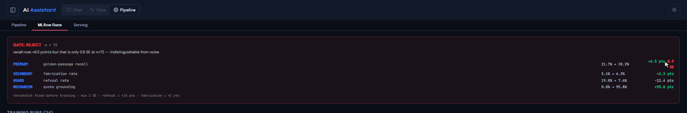
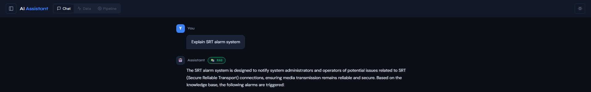
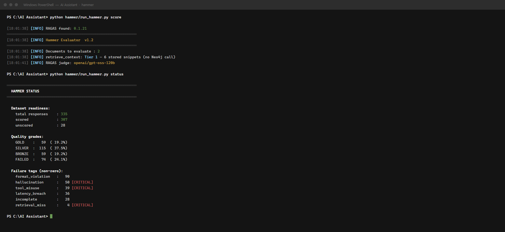
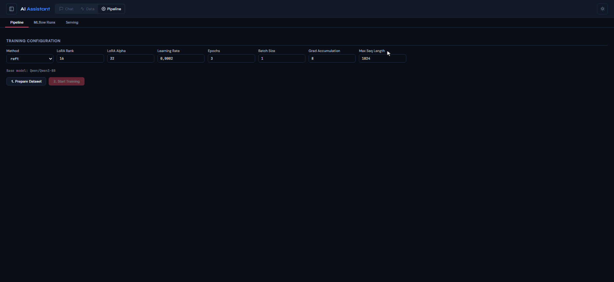
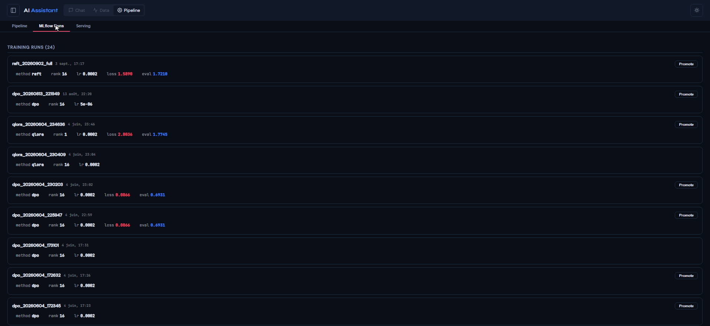
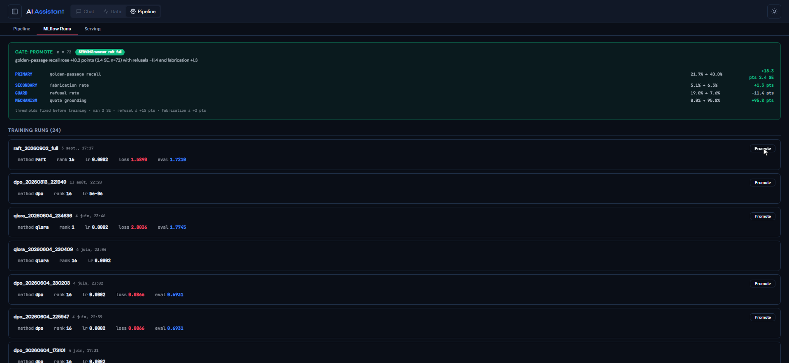
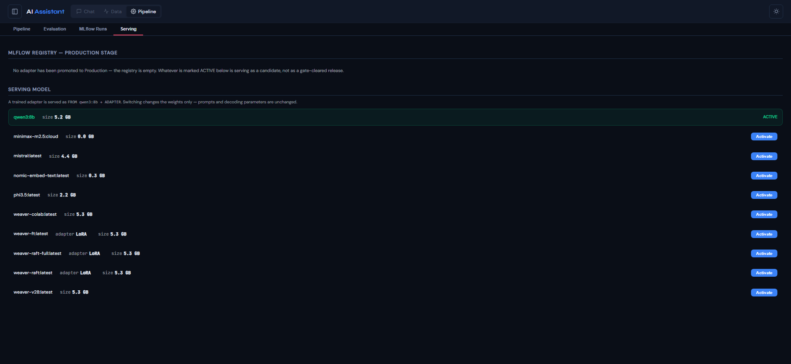

# AI Assistant — Hybrid Graph-RAG + Live-API Agent with a Gated Self-Improving Loop

A production-style, fully local enterprise assistant that answers engineering questions from **two sources at once**: a Neo4j knowledge graph built from Jira/Confluence/GitLab exports (vector + multi-hop graph retrieval), and the **live** GitLab/Jira/Confluence APIs. A LangGraph agent routes each question, a local LLM (Ollama) synthesizes the answer, and an evaluation pipeline ("Hammer") scores every response, mines training data from its own verdicts, and **gates** fine-tuned adapter deployments.

Everything runs locally: Neo4j, MongoDB, Ollama, and RAFT fine-tuning on QLoRA adapters sized for a 6 GB consumer GPU.

## Architecture



Ingestion builds the knowledge graph; the LangGraph agent answers from graph retrieval **and** the live APIs; every answer is scored by Hammer and mined into RAFT training data; runs are tracked in MLflow; and an adapter reaches production only by passing a promotion gate whose thresholds were fixed before training.

## Highlights

- **Hybrid retrieval**: embedding ANN over chunk vectors stored in Neo4j, expanded through typed Jira link edges (BLOCKS, RELATES_TO, CHILD_OF, …) and the Confluence page hierarchy, then reranked with a cross-encoder. Questions naming a ticket key bypass search entirely with a direct indexed graph fetch.
- **Deterministic routing**: a keyword/regex intent classifier (no LLM latency on the hot path) with an optional LLM fallback; ~30 routing rules map natural language to concrete API calls (JQL, CQL, GitLab REST) with conversation context carry-over and per-project fan-out caps.
- **Context-budgeted generation**: every prompt section (knowledge base, live data, history) has an enforced budget so the model window can never silently overflow.
- **Two-track evaluation**: RAGAS faithfulness/relevance where a judge applies, plus a **zero-LLM deterministic validator** that checks whether cited ticket keys actually appear in the retrieved sources. The validator holds a veto — set membership cannot be argued with, an LLM judge can.
- **Gated promotion**: promotion is a request for a decision, not a shipping button. The gate scores a candidate against pre-registered thresholds and only a `PROMOTE` verdict registers the run and switches the served model.
- **Bilingual**: English and French queries throughout the routing and prompting layers.

## Why it matters

Engineering teams lose hours per week re-checking Jira, Confluence and GitLab by hand because they don't trust assistant answers. This project attacks that trust problem end to end, with measured results rather than claims:

- **Answers users can act on.** Cross-encoder reranking, direct ticket lookup, and metadata-grounded citations (status, priority, assignee, URL) mean answers are verifiable at a glance.
- **No silent failures on high-stakes questions.** Multi-source prompts used to overflow the model window (~12.6k tokens against a 10.2k budget), silently dropping the instructions — exactly on the complex questions where stakes are highest. Context is now budgeted by design; the same scenario fits at 5.7k tokens.
- **Costs that don't scale with company size.** Broad queries used to fan out one API call per repository; caps cut a verified 40→12 (GitLab) and 30→10 (Jira) calls, bounding both latency and rate-limit exposure as the org grows.
- **Training spend that isn't wasted.** The evaluation layer was provably mislabeling correct answers as hallucinations, poisoning the training pool. **84 contaminated documents** were removed and the mislabeling rate cut from ~35% to ~25%, so every GPU-hour trains on clean labels in the production prompt format.

## The self-improving loop, and where it stops

The loop is built end to end and every stage is exercised: answers are scored, failures are tagged, training data is exported locally, an adapter trains, and the gate rules on it.

**What the RAFT adapter demonstrably changed**, measured on a held-out set with both arms generated through the same served model at the same quantisation, so the adapter is the only difference:

| | base | with adapter |
|---|---|---|
| Answers grounded in a quoted span | 0.00% | **95.83%** |
| Answers citing a span at all | 0.00% | **84.81%** |
| Refusal rate | 18.99% | **7.59%** |
| Training run | — | **114/114 steps, 0 NaN, 252/252 adapter matrices live** |

The base model emitted **no** citable spans; the adapter emits one in five of every six answers, and **69 of 72** are verbatim substrings of the retrieved context rather than reconstructions from memory. Refusals fell at the same time, which is the combination this style of training usually fails to achieve.

**And the gate refused it anyway.** The accuracy gain — +6.5 points — is 0.9 standard errors at n=72, short of the two fixed before training. No guard tripped: refusals fell and fabrication stayed inside tolerance. The candidate was declined for insufficient evidence, not bad behaviour.



That is the intended outcome, not a disappointment. A gate that only ever approves proves nothing about the candidates it approves; this one refused its own author's adapter, on a rule written before the adapter existed.

## Scale

Built and tested against a real enterprise corpus, not a toy dataset:

| Metric | Value |
|---|---|
| Embedded corpus | **~24 GB** of pre-embedded chunks (20 GB Jira + 3.7 GB Confluence JSONL) |
| Jira issues represented | ~424,000 across dozens of projects |
| Chunk nodes in Neo4j (768-dim vectors) | **~1.28M** |
| Graph relationships (PART_OF, BLOCKS, RELATES_TO, CHILD_OF, …) | **~1.46M** |
| Typed Jira link relationship types modeled | 20+ (BLOCKS, CAUSES, DUPLICATES, IMPLEMENTS, SPLIT_FROM, …) |
| Fine-tuning hardware | single RTX 3050 (6 GB) — 4-bit NF4 base + LoRA adapter, gradient checkpointing |

## Screenshots

| Answering from retrieved context | Hammer / RAGAS evaluation |
|---|---|
|  |  |

| RAFT training configuration | MLflow run history |
|---|---|
|  |  |

| Gate promotes and attaches the adapter | Adapter serving |
|---|---|
|  |  |

## Engineering rigor

The stack went through documented optimization rounds with A/B verification, including fixes caught by automated checks rather than by eye: a prompt-overflow bug (12.6k tokens silently truncated against a 10.2k window), API fan-out cut 40→12 calls on broad queries, evaluation mislabeling that poisoned training data, training prompts that had drifted from inference prompts, and a promotion path that could never ship.

Two defects are worth naming because the safeguards caught them, not a human:

- A training set in which **20% of targets were one identical abstention sentence**. The loss curve looked healthy; the model was memorising a string. The gate's degenerate-abstention rule caught it, and abstentions are now derived from the passages actually retrieved.
- A promotion control that called the registry **before** evaluating. The rule existed and was never consulted. Promotion now evaluates first and acts on the answer.

## Stack

Python · Neo4j 5 (vector index + Cypher) · MongoDB · Ollama (Qwen3) · sentence-transformers (arctic-embed-m + cross-encoder rerank) · LangGraph · RAGAS · MLflow · TRL/PEFT (RAFT on QLoRA adapters) · FastAPI · React

## Repository layout

| Path | What it is |
|---|---|
| `rag/` | Neo4j import (graph schema + vector index), hybrid search engine, RAG generator |
| `agent/` | LangGraph intent agent, intent classifier, answer weaver |
| `sentries/` | Live-API layer: dispatcher, GitLab/Jira/Confluence clients, NL→API router |
| `hammer/` | Evaluator, deterministic validator, dataset builder, promotion gate |
| `training/` | RAFT training pipeline with MLflow tracking |
| `api/`, `frontend/` | FastAPI backend + React UI |
| `pipeline/` | Source-system extraction/embedding pipeline |

## Run with Docker (fastest)

```bash
cp .env.example .env            # set NEO4J_PASSWORD + your API tokens
ollama serve && ollama pull qwen3:8b   # Ollama runs on the host (GPU)
docker compose up -d --build
```

That starts **Neo4j 5 + APOC** (browser: `:7474`), **MongoDB**, the **FastAPI backend** (`:8000`), and the **React frontend** (`:3000`). On CPU-only machines, add the CPU override: `docker compose -f docker-compose.yml -f docker-compose.cpu.yml up -d --build`. Then load your data: `docker compose exec backend python -m rag.neo4j_import`.

> Running the backend on the host instead? Start only the data services — `docker compose up -d neo4j mongo` — otherwise the containerised Ollama takes port 11434 from your local one, and locally built adapters will not be visible.

## Quickstart (bare metal)

```bash
# 1. Infrastructure
docker compose up -d neo4j mongo
ollama serve && ollama pull qwen3:8b

# 2. Python env
python -m venv .venv && .venv/Scripts/activate
pip install -r requirements.txt

# 3. Configure
cp .env.example .env            # fill in credentials

# 4. Build the knowledge graph (from your embedded chunk exports)
python -m rag.neo4j_import

# 5. Talk to it
python agent/intent_agent.py    # interactive CLI (/timing, /impl, /history)

# 6. Run the evaluation loop
python -m hammer.run_hammer status
python -m hammer.run_hammer score --limit 20 --dry-run
```

All tunables (retrieval depth, rerank pool, context budgets, fan-out caps, eval thresholds, training hyperparameters) are environment variables — see [`.env.example`](.env.example).

## Evaluation → training → gate

Training data is a by-product of using the assistant and scoring it. Nothing leaves the machine, and there is no separate labelling pass.

```bash
python -m hammer.run_hammer score              # score new chat turns
python -m hammer.run_hammer dataset raft       # export a RAFT set from the verdicts
python training/pipeline.py check-compat       # adapter <-> serving model guard
python training/pipeline.py prepare && python training/pipeline.py train --method raft
python -m hammer.raft_gate --before metrics_before.json --after metrics_after.json
```

Each exported example places the answering passage among distractors and requires the target to quote its evidence before answering; a complementary share withholds the answering passage so the target must decline. Two guards run at export time rather than being discovered later by the gate: abstentions are derived from their own context, and a set whose targets are more than 5% identical is flagged.

The gate returns `PROMOTE` or `REJECT` with the rule that fired and the measured deltas. Only a `PROMOTE` registers the run and switches the served model — from the CLI or from the Promote control in the UI, which runs the same gate.

## Notes

- Training a Qwen3 adapter requires `transformers >= 4.51`; the inference environment pins an older release, so training runs in its own environment or on rented GPU.
- Example data, vector stores, model checkpoints, and generated reports are intentionally not part of the repository (see `.gitignore`); bring your own Jira/Confluence/GitLab exports.
- Project names and ticket keys appearing in code comments and docs are illustrative.
